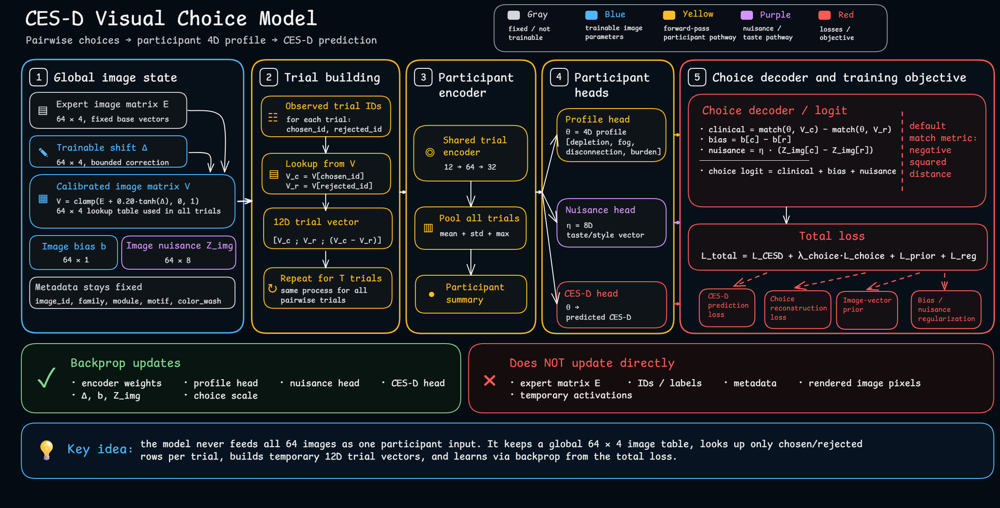

# CES-D Visual Choice Model

This project builds a pairwise visual test around abstract Rorschach-like images.
Participants choose between two images across multiple trials. Those choices are used to infer a 4D visual profile and predict CES-D depressive-symptom scores.

This is a research/measurement prototype, not a clinical diagnostic tool!!!

## Contents

- [1. Core idea](#1-core-idea)
- [2. Image bank](#2-image-bank)
- [3. Modules](#3-modules)
- [4. Motifs vs module style](#4-motifs-vs-module-style)
  - [Module style](#module-style)
  - [Motif style](#motif-style)
  - [Why do motif and module style overlap?](#why-do-motif-and-module-style-overlap)
- [5. Rendering grammar](#5-rendering-grammar)
- [6. Pairwise task](#6-pairwise-task)
- [7. Model structure](#7-model-structure)
- [8. Bias and nuisance terms](#8-bias-and-nuisance-terms)
  - [Image bias](#image-bias)
  - [Image nuisance embedding](#image-nuisance-embedding)
  - [Participant nuisance vector](#participant-nuisance-vector)
  - [Why this matters](#why-this-matters)
- [9. Image-vector calibration](#9-image-vector-calibration)
- [10. Training objective](#10-training-objective)
- [11. Trial selection](#11-trial-selection)
- [12. MODEL DESIGN](#12-model-design)
- [13. Code map](#13-code-map)
- [14. Minimal run notes](#14-minimal-run-notes)

---


## 1. Core idea

Each image has a hidden 4D vector:

| Dimension | Meaning | Main visual tendency |
|---|---|---|
| `depletion` | low energy, slowing, difficulty initiating | lower, pooled, slumped forms |
| `fog` | mental haze, low clarity | soft edges, blur, noise, partial erasure |
| `disconnection` | distance, isolation, fragmentation | central gaps, split lobes, detached islands |
| `burden` | emotional weight, pressure | darkness, compression, downward streaks |

The model tries to learn a participant profile in the same 4D space:

```text
participant choices -> 4D profile -> CES-D prediction
```

The important constraint is that the profile should do two things at once:

1. predict CES-D, and
2. explain the participant's pairwise visual choices.

That is what keeps the model from becoming only a black-box CES-D predictor.

---

## 2. Image bank

The current image bank contains 64 images:

| Family | Count | Purpose |
|---|---:|---|
| `anchor` | 16 | clean single-dimension examples |
| `blend` | 24 | two-dimension mixed stimuli |
| `ambiguous` | 12 | mixed images that are not obviously one thing |
| `foil` | 12 | controls against shortcuts like “darker = worse” |

Every image has:

- an `image_id`
- a `family`
- a `module`
- a `motif`
- a deterministic `seed`
- a 4D `seed_vector`
- a render-only `color_wash`

`color_wash` is not a fifth psychological dimension. It only controls how much muted watercolor/pastel tint is applied during rendering.

---

## 3. Modules

A module is the image's broad semantic/style context.

| Module | Main latent dimension |
|---|---|
| `energy` | `depletion` |
| `clarity` | `fog` |
| `connection` | `disconnection` |
| `burden` | `burden` |

In the image bank, the module is assigned from the dominant dimension of the image's seed vector. For example, if `fog` is the strongest seed-vector value, the image is assigned to the `clarity` module.

Important nuance: after training, the learned image vector can shift slightly, but the image's module metadata stays fixed. The module is therefore best understood as the original rendering context, not as a value that is recomputed after calibration.

---

## 4. Motifs vs module style

This project uses both motifs and module style because they solve different problems.

### Module style

Module style gives each latent dimension a stable visual identity.

| Module | Visual signature |
|---|---|
| `energy` | low, pooled, slumped, less fragmented |
| `clarity` | diffuse, foggy, soft, partially erased |
| `connection` | split lobes, wider gaps, detached fragments |
| `burden` | darker, compressed, pressured, downward streaking |

Module style is deliberately strong. It needs to survive averaging across prompts/images so that aggregate profiles still look different.

### Motif style

A motif is a local composition recipe: a particular “shape of expression.”

Examples:

- `winged_mantle`
- `tidal_pour`
- `central_cavern`
- `paired_lobes`
- `root_plume`

Motifs change composition flavor, not clinical meaning. They make images less repetitive while preserving the same underlying 4D grammar.

Motif style uses smaller controls such as:

| Motif-style coordinate | Meaning |
|---|---|
| `wide` | horizontal spread |
| `vertical` | tall vs flat shape |
| `void` | central empty-space tendency |
| `tendril` | drips/streaks |
| `grain` | noisy/soft texture |

### Why do motif and module style overlap?

They overlap because both have to talk to the same renderer.

The renderer ultimately needs concrete drawing controls: width, verticality, voids, tendrils, grain, darkness, softness, mass, and so on. Both the module and the motif can push some of those controls.

But they mean different things:

```text
4D vector     = psychological signal / severity
module style  = stable dimension-level identity
motif style   = local image-level composition variation
```

Example:

- `connection` module may increase gaps and detached fragments because that is part of the disconnection signal.
- `central_cavern` motif may also increase central void, but only as a local composition flavor.

So the overlap is intentional. It lets the same psychological state appear in different visual forms without losing the dimension-level structure.

---

## 5. Rendering grammar

The renderer converts:

```text
4D vector + module + motif + seed -> RorschachGrammar -> final image
```

The intermediate `RorschachGrammar` contains drawing channels such as:

```text
intensity, mass, darkness, symmetry, integration,
boundary_softness, edge_complexity, central_void,
satellite_islands, gravity, verticality, tendrils,
paper_grain, fold_axis
```

The 4D vector drives the main visual signal:

- `depletion` increases gravity/slumping and contributes to mass.
- `fog` increases softness, grain, blur, wash, and partial erasure.
- `disconnection` reduces symmetry/integration and increases central voids/islands.
- `burden` increases darkness, compression, gravity, verticality, and tendrils.

The current `intensity` formula gives the module-relevant dimension the strongest weight, while still including the maximum overall state and the off-module average. This prevents the renderer from ignoring mixed states.

---

## 6. Pairwise task

Participants do not directly rate images on the four dimensions. They choose between two images.

The prompts are intentionally broad and neutral, for example:

```text
Which image feels closer to your past week?
Which image feels more familiar right now?
Which image feels more like your current inner weather?
```

The goal is not to claim that a single image literally reveals the subconscious. The goal is to collect weak preference signals across many trials, then estimate a participant-level profile from the pattern of choices.

---

## 7. Model structure

### Model diagram




Each trial is represented as:

```text
chosen image 4D vector + rejected image 4D vector + difference vector = 12D
```

The model encodes each trial, pools information across all trials, then produces:

1. `profile4` -- the interpretable participant profile:
   - `depletion`
   - `fog`
   - `disconnection`
   - `burden`
2. `nuisance` -- a non-clinical taste/style vector used only to explain choices.

The 4D profile predicts CES-D.

The same 4D profile also helps reconstruct choices: the chosen image should usually be closer to the participant's inferred profile than the rejected image.

By default, the choice decoder uses squared distance:

```text
utility(image) = - distance(participant_profile, image_vector)^2
```

So closer images get higher clinical utility.

---

## 8. Bias and nuisance terms

Real visual choices are not purely clinical.

A participant might choose an image because it is more symmetrical, more attractive, darker, stranger, more colorful, or simply more visually salient. If the model had no way to absorb those effects, it could incorrectly force them into the four clinical dimensions.

That is why the model includes nuisance terms.

### Image bias

`image_bias_j` is a learned scalar for each image.

It captures general image attractiveness/salience:

```text
some images may be chosen more often regardless of clinical meaning
```

In the pairwise logit, the model uses the difference:

```text
image_bias(chosen) - image_bias(rejected)
```

This prevents a generally popular image from distorting the clinical 4D space.

### Image nuisance embedding

`image_nuisance_j` is a learned non-clinical embedding for each image.

It captures style/taste properties that are not supposed to become `depletion`, `fog`, `disconnection`, or `burden`.

### Participant nuisance vector

`participant_nuisance_i` is inferred from the participant's choices.

It represents personal visual taste/style preference. For example, one participant may generally prefer softer images, while another may prefer more structured images.

The nuisance choice effect is an interaction:

```text
participant_nuisance · (image_nuisance(chosen) - image_nuisance(rejected))
```

So the final choice logit is roughly:

```text
clinical 4D match
+ general image bias
+ participant-specific nuisance/taste match
```

### Why this matters

The nuisance terms are guardrails.

They allow the model to explain non-clinical preference patterns without corrupting the exported 4D profile.

By default, CES-D prediction uses the 4D profile, not the nuisance vector. The nuisance vector helps choice reconstruction, but the main participant output remains interpretable.

The nuisance and bias terms are also regularized, so they stay modest unless they genuinely improve choice reconstruction.

---

## 9. Image-vector calibration

Images start with expert-defined 4D vectors.

During training, the model can slightly adjust those vectors:

```text
learned image vector = expert vector + small learned shift
```

The shift is constrained:

- vectors are clamped to the 0..1 range
- the maximum shift is limited
- an expert-vector prior pulls learned vectors back toward the original expert values

This lets the data correct imperfect expert assumptions without letting the image meanings drift completely.

The exported `learned_image_vectors.csv` shows:

- original expert vectors
- learned/calibrated vectors
- per-dimension deltas
- total visual shift
- image bias
- image nuisance norm

---

## 10. Training objective

The training loss combines:

```text
CES-D prediction loss
+ choice reconstruction loss
+ image-vector prior
+ bias/nuisance regularization
```

Each part has a different role:

| Loss part | Purpose |
|---|---|
| CES-D loss | make the profile clinically predictive |
| choice loss | make the profile explain visual choices |
| image-vector prior | keep calibrated image vectors close to expert meanings |
| bias/nuisance regularization | prevent nuisance channels from taking over |

This is the main reason the model is more interpretable than a simple black-box predictor.

---

## 11. Trial selection

The full bank can produce more trials than the final public test needs.

The selection script estimates trial usefulness by permutation importance:

1. compute baseline model performance,
2. shuffle one trial's responses across participants,
3. measure how much performance drops,
4. keep useful trials while enforcing rough family coverage.

This is an item-reduction helper. It is not a substitute for validating the reduced test on new data.

---

## 12. MODEL DESIGN

The model does not receive the whole image bank as one flat vector. Even though the bank has 64 images and each image has a 4D clinical vector, this is stored as a table:

```text
64 images × 4 dimensions = 64 × 4 image-vector table
```

This is global model state, not a participant-level input.

For a single participant, the model only uses the images that appear in that participant's trials. In each trial, there is a chosen image and a rejected image. The model looks up both image IDs in the global `64 × 4` table:

```text
chosen_image_id   -> lookup chosen 4D vector
rejected_image_id -> lookup rejected 4D vector
```

Then the trial input is built as:

```text
chosen 4D + rejected 4D + difference 4D = 12D trial vector
```

So the flow is:

```text
global image table: 64 × 4
        |
        | lookup chosen/rejected images for each trial
        v
20 trials × 12D
        |
trial encoder
        |
pooling across trials
        |
participant 4D profile
        |
CES-D prediction
```

The `64 × 4` table is still trainable. During backprop, only the image rows that were used in the current batch receive gradients. Across many participants and trials, different image rows are repeatedly used and updated.

```text
expert image vectors:      64 × 4
learned image deltas:      64 × 4
calibrated image vectors:  64 × 4
```

Each trial then selects two rows from this table and turns them into one `12D` trial representation.

The same lookup idea also applies to the non-clinical image terms:

```text
image bias:       64 × 1
image nuisance:   64 × nuisance_dim
```

These are also indexed by chosen/rejected image ID, but they are not concatenated into the `12D` trial input. They enter later in the choice-reconstruction decoder.

## 13. Code map

| File | Role |
|---|---|
| `_pairwise_bank.py` | defines the 64-image bank and pairwise trial design |
| `_render_images_rorschach_heuristics.py` | renders Rorschach-style images from 4D vectors, modules, and motifs |
| `01_train_choice_calibrated_4d.py` | trains the choice-calibrated 4D model |
| `02_render_pairwise_bank.py` | renders the bank, optionally using learned vectors |
| `03_select_final_trials.py` | selects a reduced final test using trial importance and family coverage |

---

## 14. Minimal run notes

Typical flow:

```bash
python 01_train_choice_calibrated_4d.py
python 02_render_pairwise_bank.py
python 03_select_final_trials.py
```
